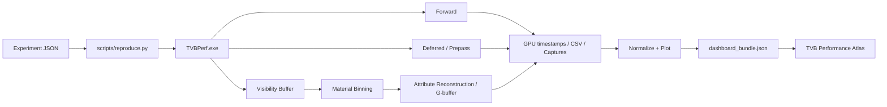

# Visibility Buffer Bench

> A reproducible Direct3D 12 testbed for mapping when visibility-driven shading wins—and why it loses.

Visibility Buffer Bench는 Forward, Deferred, Triangle Visibility Buffer(TVB)를 같은 D3D12 실행 환경에서 비교해 **어떤 workload에서 승패가 바뀌는지** 찾는 연구 프로젝트다. 평균 프레임 시간 하나로 결론내리지 않고 geometry density, overdraw, quad waste, material class, locality, resolution을 독립적으로 바꾸고 GPU 시간을 pass 단위로 분해한다.

## 결론부터

TVB가 항상 빠르다는 결론은 나오지 않았다. 현재 실제 장면 경로인 `visibility → material binning → compute G-buffer → lighting`은 geometry 비용을 줄이는 구간이 있었지만, visibility와 material scheduling, attribute reconstruction 비용을 합치면 Deferred + depth pre-pass보다 느렸다.

2026-08-19에 RTX 5060 Ti 16GB에서 다시 측정한 전체 camera playback의 평균 GPU 시간은 다음과 같다.

| Scene | DeferredPrepass | VisBuf + G-buffer | VisBuf overhead |
|---|---:|---:|---:|
| Sponza | 1.15173 ms | 1.75000 ms | +51.9% |
| Sponza + Ivy | 1.67838 ms | 2.06863 ms | +23.3% |
| Bistro Exterior | 0.53561 ms | 0.67544 ms | +26.1% |

측정 조건은 Release build, 1920×1080, VSync off, texture/VFC on, warm-up 60 frames, 고정 camera playback이다. Sponza 계열은 2,500 frames, Bistro는 5,500 frames를 측정했다. 이 수치는 특정 구현·GPU·driver·scene·camera의 결과이며 TVB 일반의 우열을 뜻하지 않는다.

### 부분 이득이 전체 승리로 이어지지 않은 이유

| Scene | Deferred geometry + depth | VisBuf compute G-buffer | Visibility | Binning |
|---|---:|---:|---:|---:|
| Sponza | 1.01117 ms | 1.30866 ms | 0.22163 ms | 0.06782 ms |
| Sponza + Ivy | 1.53945 ms | 1.30502 ms | 0.54059 ms | 0.07049 ms |
| Bistro Exterior | 0.38849 ms | 0.21800 ms | 0.21555 ms | 0.07139 ms |

Sponza + Ivy와 Bistro에서는 compute G-buffer가 Deferred의 geometry+depth보다 각각 약 0.234 ms, 0.170 ms 저렴했다. 그러나 visibility+binning이 약 0.611 ms, 0.287 ms 추가되어 승패가 다시 뒤집혔다. 현재 개선 우선순위는 shared lighting보다 visibility raster, class scheduling, memory-locality-related reconstruction이다. Nsight/PIX counter 없이 특정 cache나 VRAM bandwidth 병목으로 단정하지 않는다.

세부 결과와 해석은 [docs/results.md](docs/results.md)에 정리했다.

## 연구를 어떻게 전개했나

### 1. Synthetic scene에서 성능 경계를 분리했다

**가설.** Forward는 overdraw와 quad waste가 클수록 불필요한 shading을 반복하고, Deferred는 G-buffer read/write 비용을 지불한다. TVB는 visibility pass와 resolve, vertex/index/material 간접 접근이라는 고정비를 지불하므로 geometry와 shading이 무거워질수록 상대적으로 유리해질 수 있다.

**구현과 실험.** geometry density, overdraw, projected triangle/quad waste, ALU, texture sampling, material 수, active class 수, locality/diversity, resolution을 JSON spec에서 독립적으로 sweep했다. 모든 renderer는 같은 process에서 같은 GPU timestamp와 결과 schema를 사용한다.

**관찰.** 한 active class에 material을 모으면 material record 1→255에서 VisBuf는 0.31926→0.32935 ms로만 증가했다. 반대로 255 materials를 유지하고 active class를 1→255로 늘리면 0.34372→0.54730 ms로 증가했다. 같은 조건의 Deferred는 0.28062→0.27989 ms였다.

**해석과 한계.** 현재 material 관련 비용은 record 수보다 histogram/prefix/flatten과 class별 dispatch에 더 민감하다. 다만 모든 class가 generic shader body를 사용하므로 실제 material specialization의 branch·occupancy 이득까지 측정한 결과는 아니다.

### 2. 실제 장면에서 synthetic 해석이 유지되는지 확인했다

**가설.** geometry가 무거운 실제 장면에서는 TVB reconstruction의 고정비가 상쇄되고 Deferred와의 격차가 줄어들 수 있다.

**구현과 실험.** Assimp로 Sponza, Sponza + Ivy, Bistro를 동일한 scene/material 계약으로 불러오고, texture와 view-frustum culling을 켠 고정 camera playback에서 DeferredPrepass와 VisBuf+G-buffer를 비교했다. 결과는 total뿐 아니라 visibility, histogram, prefix, flatten, G-buffer, lighting, tonemap으로 나눴다.

**관찰과 해석.** geometry/G-buffer 구간만 보면 TVB가 이득을 얻는 장면이 있었지만, 앞의 pass breakdown처럼 visibility와 binning을 포함한 end-to-end 결과는 세 장면 모두 DeferredPrepass가 빨랐다. 따라서 geometry 절감 하나만으로 TVB의 승리를 예측할 수 없다.

**한계.** 현재 실제 장면 구현은 direct visibility shading이 아니라 기존 lighting과 비교하기 위한 **VisBuf→G-buffer compatibility path**다. 위 결과에는 이 reconstruction compatibility tax가 포함된다.

### 3. Barycentric과 derivative reconstruction을 성능과 분리해 검증했다

**가설.** 성능이 빨라도 visibility resolve가 hardware raster interpolation과 다른 값을 만들면 비교 자체가 성립하지 않는다.

**구현과 실험.** hardware `SV_Barycentrics` reference와 analytic VisBuf reconstruction을 별도 renderer로 만들고 linear/perspective barycentric, barycentric dx/dy, UV dx/dy, texture LOD proxy를 같은 camera frame에서 캡처했다.

**관찰.** 현재 코드로 Sponza와 Bistro validation 28/28 runs가 전체 playback을 완료했다. 각 Sponza run은 2,500 measured frames와 42 captures, 각 Bistro run은 5,500 measured frames와 46 captures를 생성했다. 이전 910 frame-pair 분석에서는 interior channel 98.3831%가 bit-exact였고 평균 오차는 8-bit 기준 0.018412 LSB, 평균 coverage mismatch는 0%였다.

**한계.** 이 검증은 sampled opaque 장면의 interpolation/reconstruction 계약에 대한 것이다. alpha blend, transmission, shadow, IBL이나 최종 이미지 전체의 동일성을 보증하지 않는다.

## 직접 구현한 범위

| 직접 설계·구현·검증 | 외부 기반 요소 |
|---|---|
| Forward/Prepass, Deferred/Prepass, VisBuf, VisBuf+G-buffer 비교 pipeline | Direct3D 12와 Win32 runtime |
| draw/geometry instance ID + triangle ID visibility contract | NVIDIA Donut 유래 PBR shader/scene layout 일부 |
| histogram → prefix → flatten → class dispatch Material Binning | DirectXTex, fastgltf, DXC, Assimp |
| barycentric/derivative/UV LOD reconstruction과 raster reference | Sponza, Bistro 등 외부 scene asset |
| synthetic parameterization, fixed camera playback, pass별 GPU timestamp | 각 외부 구성요소의 원본 라이선스 |
| build → run → normalize → plot → dashboard bundle 자동화 | 별도 웹 시각화 프로젝트 |

NVRHI runtime은 vendored/link되지 않는다. Donut과 기타 외부 코드의 정확한 범위는 [THIRD_PARTY_NOTICES.md](THIRD_PARTY_NOTICES.md), 장면 출처와 배포 조건은 [SCENE_ASSET_NOTICES.md](SCENE_ASSET_NOTICES.md)를 따른다.

## 실행 구조



저장소에는 결과 CSV/PNG가 아니라 결과를 만드는 C++·HLSL·Python·JSON을 저장한다. 생성물은 Git에서 제외된 `results/`에 만들어진다.

## 5분 안에 실행하기

요구 사항:

- Windows 10/11과 Direct3D 12 GPU
- Visual Studio C++ toolchain
- CMake 3.20 이상과 Ninja
- Python 3.11 이상

저장소 루트의 PowerShell에서 scene이 필요 없는 smoke를 실행한다.

```powershell
python -m pip install -r scripts/requirements.txt
python scripts/reproduce.py --suite smoke --build --overwrite
```

두 번째 명령은 `out/build/reproduce-Release`를 configure/build하고 synthetic 6 runs를 실행한 뒤 CSV, 그래프, 환경 정보와 dashboard bundle을 만든다.

```text
results/
├─ environment.json
├─ dashboard_bundle.json
└─ synthetic/followup_01_synth_decoupling_smoke/
   ├─ raw.csv
   ├─ runs.csv
   ├─ passes.csv
   ├─ frames.csv
   ├─ run_report.json
   └─ plots/
      ├─ total_time.png
      ├─ pass_breakdown.png
      └─ manifest.json
```

수동 build가 필요하면 Visual Studio 개발자 환경에서 다음 명령을 사용한다.

```powershell
cmake --build out/build/reproduce-Release --config Release
```

## 실제 장면과 포트폴리오 suite

장면 원본은 용량과 라이선스 때문에 저장소에 포함하지 않는다. `experiments/local.example.json`을 복사하고 보유한 scene alias만 로컬 경로로 지정한다.

```powershell
Copy-Item experiments/local.example.json experiments/local.json
```

```json
{
  "scenes": {
    "sponza": "D:/scenes/Sponza/NewSponza_Main.gltf",
    "sponza_ivy": "D:/scenes/Sponza/NewSponza_Main_Ivy.gltf",
    "bistro": "D:/scenes/Bistro/BistroExterior.fbx",
    "bistro_interior": "D:/scenes/Bistro/BistroInterior_Wine.fbx"
  }
}
```

그다음 대표 evidence set을 실행한다.

```powershell
python scripts/reproduce.py --suite portfolio --build --overwrite --keep-going
```

2026-08-19 검증 머신에서는 15 specs, 786 runs 중 783 success, 3 `skipped_missing_asset`, failed/salvaged 0이었다. 세 skip은 로컬에 없던 San Miguel, Sun Temple, Zero Day이며 renderer 실패와 구분되어 기록됐다. Sponza/Bistro의 performance와 correctness playback은 모두 마지막 프레임까지 완료했다.

## 재현 계약

현재 inventory는 66 canonical specs, 총 4,280 runs다. 이전 실행 의미를 그대로 옮긴 57개는 `exact`, 제거된 인자나 현재 계약에 맞게 조정한 9개는 `adapted`로 표시된다.

- `experiments/specs/`: 실행 인자, sweep/sample, 분석 선언
- `experiments/suites/`: `smoke`, `portfolio`, `all` 실행 묶음
- `experiments/camera_paths/`: 고정 camera playback
- `experiments/plot_theme.json`: renderer/pass 색과 순서
- `scripts/reproduce.py`: build, run, normalize, plot, export 단일 진입점
- `results/`: 재생성 가능한 로컬 evidence, Git ignore

```powershell
python scripts/reproduce.py --verify
python scripts/reproduce.py --suite all --dry-run
```

`environment.json`에는 GPU/driver/VRAM, OS, Python, Git commit/dirty state, executable SHA-256가 기록된다. 각 experiment의 `resolved_spec.json`과 `run_report.json`으로 실제 경로, 실행 상태, stderr와 누락 asset을 추적할 수 있다. 세부 schema와 이관 기준은 [experiments/README.md](experiments/README.md), clean-machine 절차는 [docs/reproducibility.md](docs/reproducibility.md)를 본다.

## 그래프와 Performance Atlas

그래프 종류는 각 spec의 `analysis.plots`에 선언하고 공통 Python renderer가 생성한다. 시각 언어는 다음처럼 고정했다.

- Forward: 파랑 계열
- Deferred: 주황 계열
- VisBuf: 초록 계열
- pre-pass/visibility: 밝은색, geometry: 중간색, lighting/resolve: 진한색
- histogram/prefix/flatten 같은 utility: 노랑
- shared pass: 보라, 미계측 나머지: 회색

`results/dashboard_bundle.json` 하나에는 environment, normalized runs와 PNG가 포함된다. 형제 프로젝트 [TVB Performance Atlas](../visibility-buffer-bench-dasboard)로 파일 하나만 전달한다.

```powershell
python scripts/export_dashboard.py
cd ..\visibility-buffer-bench-dasboard
npm run data:import -- ..\visibility-buffer-bench\results\dashboard_bundle.json
```

## 현재 한계

- 현재 실제 장면 TVB는 direct visibility shading이 아니라 G-buffer compatibility path다.
- opaque 중심 비교이며 alpha blend, transmission, shadow, IBL, SSAO는 범위 밖이다.
- material class는 generic shader body를 사용해 실제 specialization 이득을 포함하지 않는다.
- 대표 수치는 한 GPU와 scene/renderer 조건당 한 process run이다. process-level 반복이 더 필요하다.
- GPU timestamp와 workload proxy는 있지만 Nsight/PIX hardware counter가 없어 cache, occupancy, bandwidth 원인을 단정하지 않는다.
- scene asset은 별도 취득 대상이며 라이선스에 따라 재배포 가능 범위가 다르다.

## 문서와 라이선스

- [연구 방법과 실험 구조](docs/methodology.md)
- [대표 결과와 해석](docs/results.md)
- [실험 이관 상태](docs/experiments.md)
- [Clean build와 데이터 provenance](docs/reproducibility.md)
- [프로젝트 코드 라이선스](LICENSE)
- [외부 코드 고지](THIRD_PARTY_NOTICES.md)
- [장면 자산 고지](SCENE_ASSET_NOTICES.md)

프로젝트가 직접 작성한 코드·shader·build·automation은 파일별 예외가 없는 한 MIT다. 문서, 측정 데이터, 생성 그래프, 이미지와 영상은 현재 프로젝트 코드 MIT 범위에 포함되지 않는다.

## Related project

[fast-jungle-renderer](https://github.com/chorogchip/fast-jungle-renderer)는 대규모 Jungle Ruins를 GPU-driven 방식으로 다루는 별도 프로젝트다.
